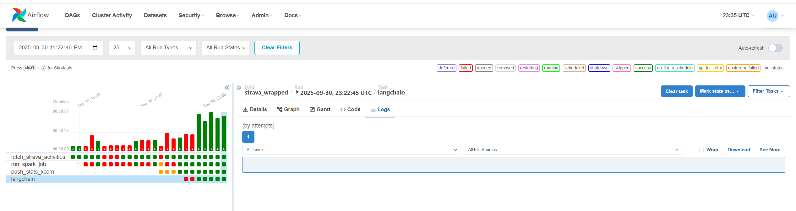
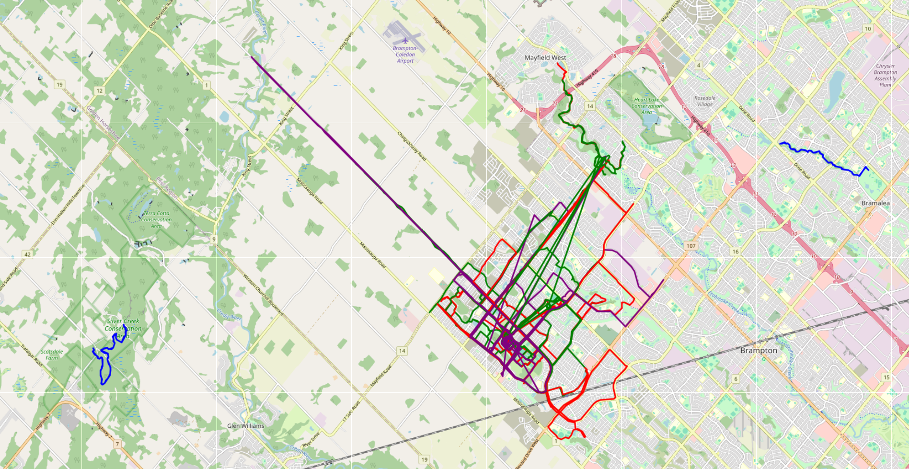

### Overview 

Just a simple project to fetch data from Strava and show some analytics on it using Airflow, PySpark and Docker to automate construction/destruction of the app and to learn to orchestrate tasks using DAGs.

### Tech Stack
- AirFlow (orchestration, scheduling, param passing via Xcoms)
- Docker (building images easily)
- PySpark (quickly creating aggregations)
- Strava API (fetching athlete activity data via O-Auth 2.0 authentication)
- OpenAI API (calling Dall-E 3 to generate "Strava Wrapped" response)

### Some Notes
A lot time was spent debugging the Docker set-up, building the correct image given the Java, PySpark, AirFlow and LangChain dependencies, and learning how to configure an AirFlow environment. Application development side which includes querying the APIs and using PySpark was fairly straightforward.

### Technical Overview
Code makes use of Docker to get an AirFlow runtime going easily. Airflow chosen as the orchestration engine. The application spins up the AirFlow scheduler and webserver, then calls the Strava API to fetch athlete activity information and also print out athlete routes onto a map which is stored as an HTML file. That gets passed via Xcoms to the PySpark job to create aggregate statistics, and then again via XComs to LangChain where it is then provided to an OpenAI API to pass the query string to Dall-E 3 to generate the Strava wrapped response. 

A custom Docker image gets used because Java needs to be installed and its environment variables set, hence that gets done inside the file.

### Docker-Compose
Spin up Postgres DB, Airflow webserver and scheduler separately. 

By default creates an 'admin' user to connect to the Airflow landing page hosted on localhost:8080. Refresh the cache or run in incognito mode to access once started.

Postgres DB is made to store Airflow metadata such as logging information.

1. Run docker build -t my-airflow:2.7.1-java . to build custom java-integrated docker-image built on top of airflow image.
2. Run docker-compose up --build
3. Open incognito tab to: localhost:8080, sign in to AirFlow environment

### Getting Strava Connected
Note: I'll add arguments to do things programatically later, for now authentication is a bit manual.

1. Run test_strava.py and this function in it specifically: authenticate_to_read_all_scope to fetch Strava scope for your account.
2. Go to outputted URL, sign in to your personal Strava account, and fetch the authentication token from redirect URL (its the section that comes after 'code'). 
3. Update AUTHENTICATION_CODE env variable with the redirect URL's provided code.
4. Run test_strava.py again and this function in it specifically: initialize_responses. This will update the strava_leaflet_map.html file!

### Mapped Out Routes
All routes are separated into segments by Haversine distance formula. Hence any two coordinates exceeding a distance of 8KM are seperated to distinct segments, we use this to draw things out since leaflet can draw lists of coordinate-pairs in layers by color.
